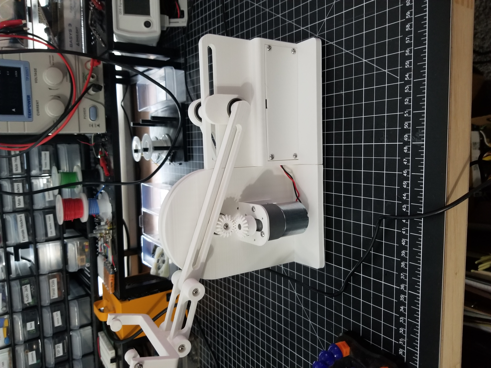
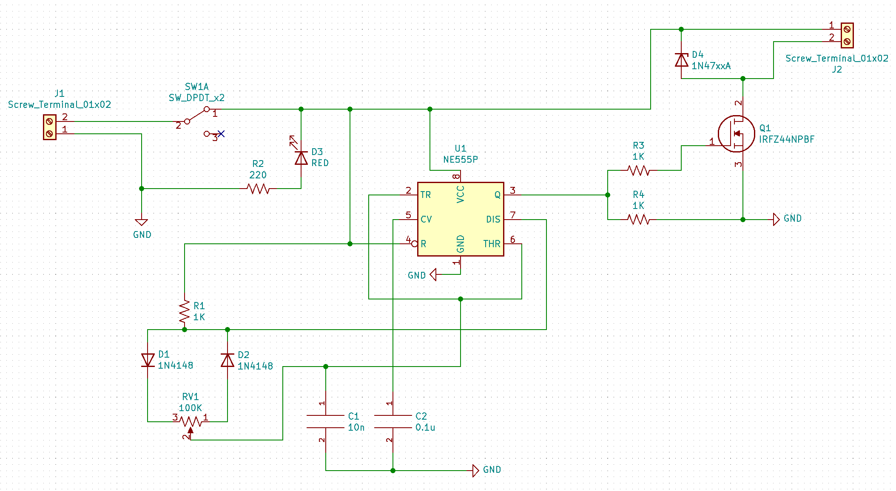
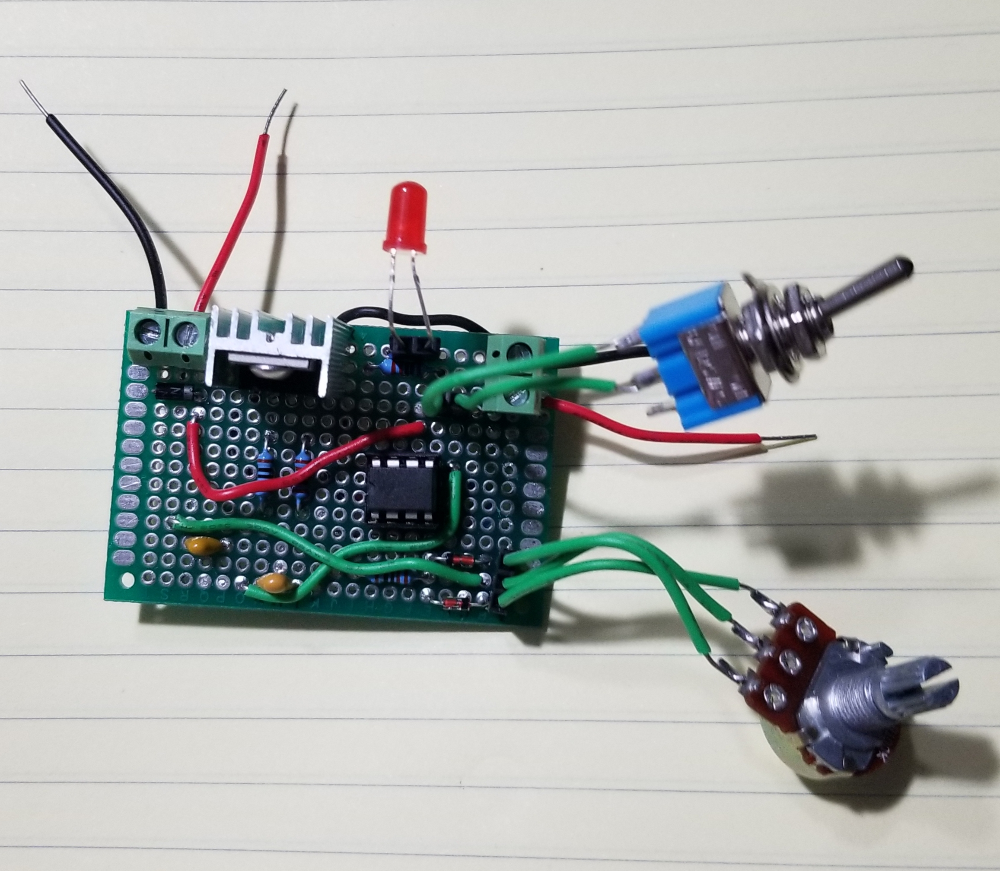
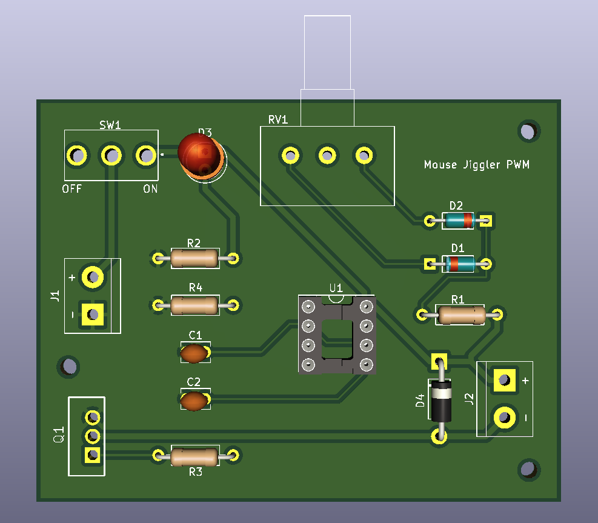
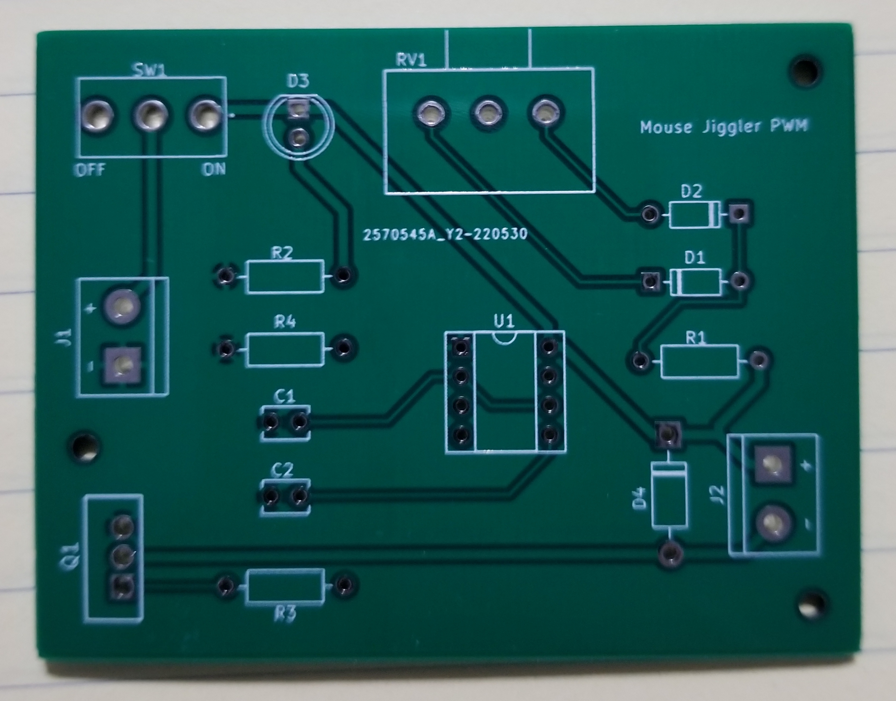
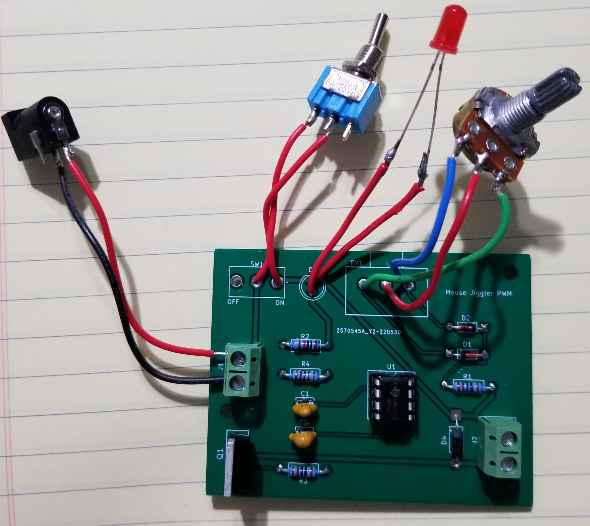
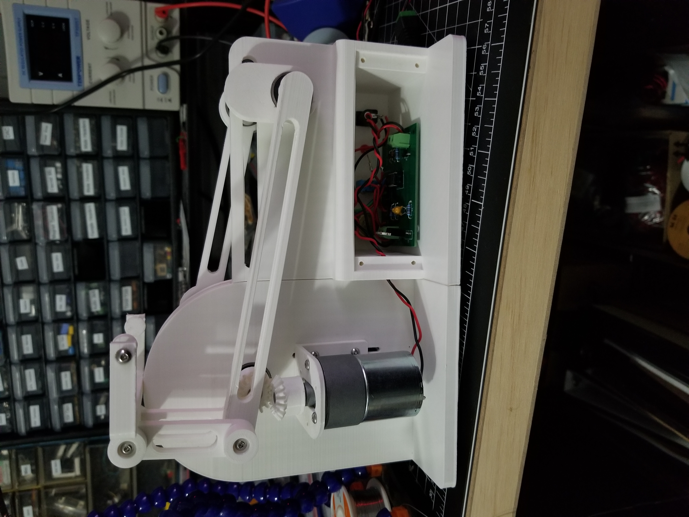

# mech-mouse-jiggler

A very impractical and stupid mouse jiggler using a crank mechanism, 12V DC motor, and a PWM circuit.

## Purpose

I wanted a basic project with some gears, a mechanical movement, and a DC motor. 
So this was the simplest thing I could think of; Move a mouse back and forth.

The mechanical movement and gears gave me more experience with components/joints in Fusion 360.
I also took the opportunity to learn KiCad and design a PCB for my basic PWM circuit.

## Finished Project

Definitely not perfect and I kept finding flaws. But, it was good enough for the project scope I made.

https://user-images.githubusercontent.com/15623775/172682833-343187b7-290f-4d06-a3b5-5a9f5e372b6b.mp4

https://user-images.githubusercontent.com/15623775/172682868-b304a3e7-49c9-4841-98fb-ab1815b85bfa.mp4

## PWM Circuit

## References

- [507 Movements #114](http://507movements.com/mm_114.html)
- [KHK Gear Reference](https://khkgears.net/new/gear_knowledge/gear_technical_reference/involute_gear_profile.html)
- [555 Timer PWM circuit](http://www.555-timer-circuits.com/motor-pwm.html)
