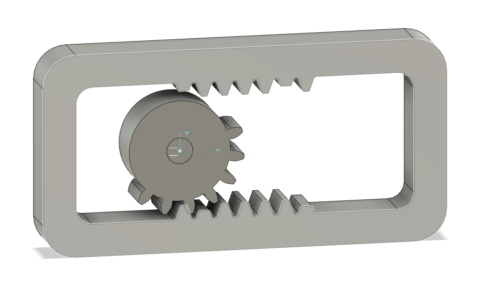

# Movement 114

Uniform circular motion into reciprocating rectilinear motion, by means of mutilated pinion, which drives alternately the top and bottom rack.

http://507movements.com/mm_114.html

- rack
  - 9 teeth top/bottom
  - backlash = 0.15mm
  - thickness = 15mm
- spur gear
  - 135 deg radial, 7 teeth
  - module = 2mm
  - backlash = 0.15mm
  - gear thickness = 15mm

